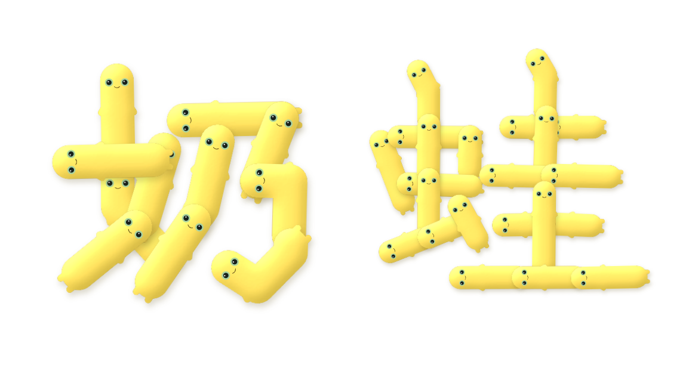
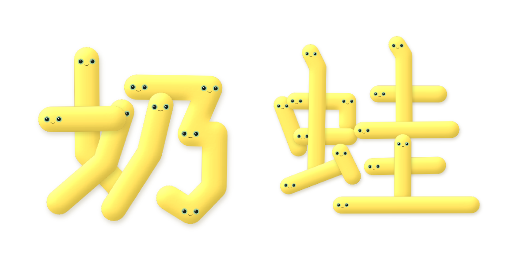

# 奶蛙文字產生器

輸入中文字，讓一隻隻黃色奶蛙排隊把字拼出來，可以下載成 PNG 或 SVG。

**線上使用：https://pojinyang.github.io/naiwa-text/**

| 積木風 | 麵條風 |
| --- | --- |
|  |  |

## 功能

- **兩種風格**
  - 積木風：筆畫在轉折處切開，每一段是一隻有小手小腳的奶蛙
  - 麵條風：每一筆是一條連續的長奶蛙，起筆和轉折處有臉
- **兩種字形**：黑體（預設）／楷書
- **可調整**：胖瘦、歪歪程度、每行字數、奶蛙顏色、小手小腳開關
- **下載**：PNG（可選透明背景）、SVG
- 支援繁體與簡體，約 9,500 個常用字；查不到筆畫資料的字元（英文、標點、罕用字）會以淺灰色一般字顯示

## 運作方式

圖片完全由程式繪製，沒有用 AI 生圖。

1. **取得筆畫資料**：從 [hanzi-writer-data](https://github.com/chanind/hanzi-writer-data) 取得每個字每一筆的中心線座標（依筆順與書寫方向排列）。
2. **整理骨架**：簡化座標點、去掉起筆收筆的小頓點，偵測橫折、豎鉤等轉角並切段，太長的段落再分給好幾隻奶蛙。
3. **黑體化**（選用）：資料本身是楷書，黑體模式會把弧線拉直、橫折收成直角、接近水平或垂直的段落對齊座標軸。
4. **畫成奶蛙**：沿著骨架畫粗線當身體，用 SVG 光照濾鏡做出鼓鼓的塑膠立體感，再加上眼睛、嘴巴和手腳，並調整方向讓臉不會倒過來。

## 開發

需要 Node.js 22 以上。

```bash
npm install
```

```bash
npm run dev
```

開發伺服器網址是 `http://localhost:5173/naiwa-text/`（注意 base 路徑）。

```bash
npm test
```

```bash
npm run build
```

### 目錄結構

```
src/
  data/loadChar.js     取得與快取筆畫資料
  geometry/            骨架處理：座標轉換、簡化、切段、黑體化、平滑曲線
  render/              SVG 濾鏡、奶蛙造型、單字與多字排版
  export.js            下載 PNG / SVG
  main.js              介面
tests/                 幾何演算法單元測試（vitest）
```

### 部署

push 到 `main` 後，GitHub Actions 會自動跑測試、build，並部署到 GitHub Pages（`.github/workflows/deploy.yml`）。

## 授權與致謝

- 字形筆畫資料來自 [Make Me a Hanzi](https://github.com/skishore/makemeahanzi) 與 [hanzi-writer-data](https://github.com/chanind/hanzi-writer-data)，原始字形為文鼎 AR PL KaitiM GB / Big5，依 [Arphic Public License](https://github.com/skishore/makemeahanzi/tree/master/APL) 授權。
- 介面字體：[粉圓體 Huninn](https://fonts.google.com/specimen/Huninn)（justfont，SIL Open Font License）。
